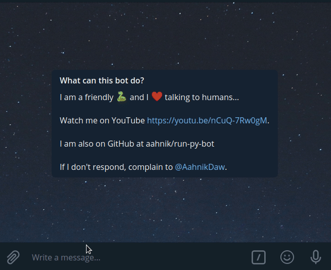

# run-py-bot
<!-- ALL-CONTRIBUTORS-BADGE:START - Do not remove or modify this section -->

<!-- ALL-CONTRIBUTORS-BADGE:END -->

Run python code from your telegram chat!

<!-- A simple bot that runs python code. Free and Open Source. For more info visit http://bit.ly/runPython -->

## Find on Telegram 🔎

You can find this bot on Telegram as [@runPython_bot](https://telegram.me/runPython_bot).

This bot is deployed on [Python Anywhere](https://www.pythonanywhere.com/) free Beginner Account.
You may check whether the bot is alive or not, by clicking on the start command. If the bot responds, it is alive.

## Featured in 😍

1. Tweet by [Dev Community](https://twitter.com/ThePracticalDev/status/1325386583537803264)
2. Tweet by [The Python Dev](https://twitter.com/The_Python_DEV/status/1325237102058016768)
3. Dor Moshe's [Newsletter](https://dormoshe.io/newsletters/ag/python/7?utm_source=twitter&utm_campaign=twitter)
4. My YouTube Video [Chatting with Python](https://youtu.be/nCuQ-7Rw0gM)

## Example Use 🔀

You may use pythonic expressions to easily calculate any complex problem. Or you may test your algorithms on the go.

## Changelog 🔖

See the [Releases](https://github.com/aahnik/run-py-bot/releases) tab for more info.

## Develop

Read the docstrings in the code for details. You will find lots of helpful links to stack overflow and documentation.

Some useful links:

1. [How to deploy a telegram bot that fetched updates using webhooks to a cloud platform like Heroku](https://github.com/aahnik/webhook-aiogram-heroku)
2. [Telegram Bot API Documentaion](https://core.telegram.org/bots/api)
3. [Aiogram Examples](https://github.com/aiogram/aiogram/tree/dev-2.x/examples)
4. [The Heroku Procfile](https://devcenter.heroku.com/articles/procfile)
5. [What are webhooks](https://www.youtube.com/results?search_query=webhooks)
6. [How to use the Rextester API to run a piece of code](https://rextester.com/main)

## Contributors ✨

Emojis assigned to each person, shows the type of contribution made by that person. See [emoji key](https://allcontributors.org/docs/en/emoji-key) to know more.

<!-- ALL-CONTRIBUTORS-LIST:START - Do not remove or modify this section -->
<!-- prettier-ignore-start -->
<!-- markdownlint-disable -->
<table>
  <tr>
    <td align="center"><a href="https://github.com/gabrielesilinic"> <b>gabrielesilinic</b></a> <a href="#security-gabrielesilinic" title="Security">🛡️</a> <a href="https://github.com/aahnik/run-py-bot/commits?author=gabrielesilinic" title="Code">💻</a></td>
    <td align="center"><a href="http://aahnik.github.io"> <b>Aahnik Daw</b></a> <a href="https://github.com/aahnik/run-py-bot/commits?author=aahnik" title="Code">💻</a> <a href="https://github.com/aahnik/run-py-bot/commits?author=aahnik" title="Documentation">📖</a></td>
    <td align="center"><a href="http://about.me/SmartManoj"> <b>மனோஜ்குமார் பழனிச்சாமி</b></a> <a href="https://github.com/aahnik/run-py-bot/issues?q=author%3ASmartManoj" title="Bug reports">🐛</a></td>
  </tr>
</table>

<!-- markdownlint-enable -->
<!-- prettier-ignore-end -->
<!-- ALL-CONTRIBUTORS-LIST:END -->

Contributions of any kind welcome! Please read [Contributing Guidelines](https://github.com/aahnik/run-py-bot/blob/main/.github/CONTRIBUTING.md) to get started.

## Social 😺

